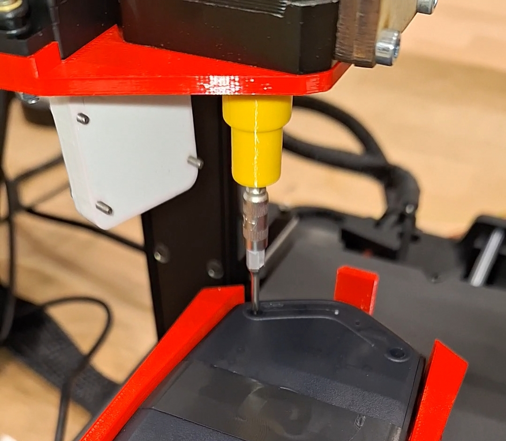

# Automated Mouse Disassembly

A custom-modified Creality Ender V3 SE 3D printer repurposed into an automated computer mouse disassembly system.
This project was developed as part of the EPFL MGT-555 Innovation & entrepreneurship in engineering course.

The original 3D printer nozzle has been replaced with a custom end effector that includes:

- An integrated screwdriver mechanism
- A controllable magnet for screw magnetization/demagnetization

